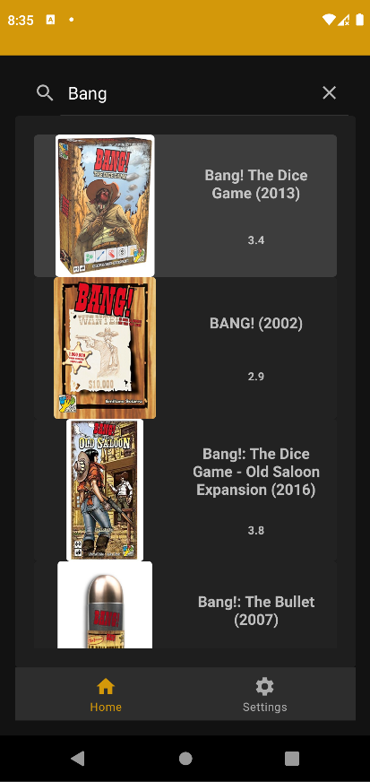
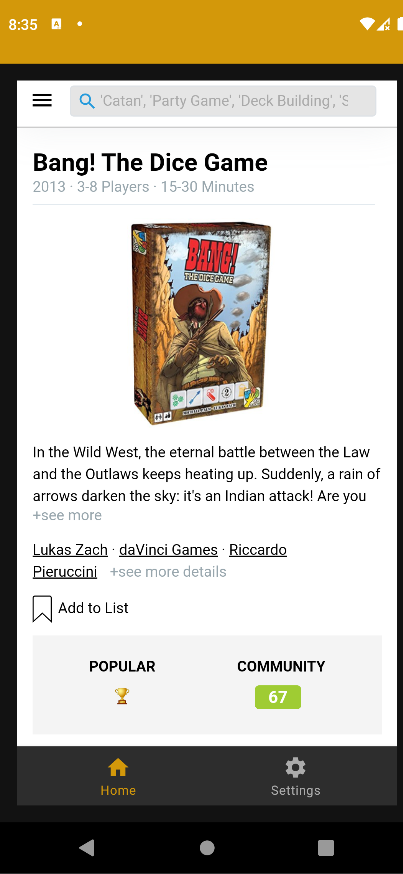
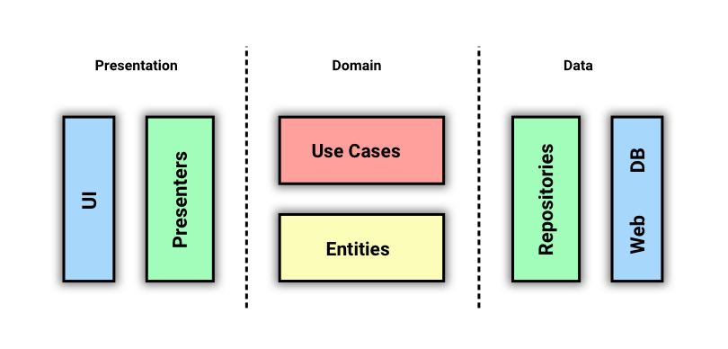

<h1>Board Games Guide 1.0</h1>

Board Games Guide is an application to search by name some board games and watch details using WebView, built using Kotlin with Clean Architecture
concepts and MVVM with Flow

## Screenshots

## Prerequisites

API is free and not needed to register

## Features

- Search for board games
- View game details in WebView
- Change dark and light themes in the settings

## Architecture

## Technologies

- [Kotlin](https://kotlinlang.org/) - %100 Kotlin
- [View Binding](https://developer.android.com/topic/libraries/view-binding)
- [ViewModel](https://developer.android.com/topic/libraries/architecture/viewmodel)
- [Navigation](https://developer.android.com/guide/navigation)
- [Glide](https://github.com/bumptech/glide) for image loading
- [Coroutines](https://github.com/Kotlin/kotlinx.coroutines) for asynchronous operations
- [StateFlow](https://kotlin.github.io/kotlinx.coroutines/kotlinx-coroutines-core/kotlinx.coroutines.flow/-state-flow/)
- [Dagger Hilt](https://developer.android.com/training/dependency-injection/hilt-android) for
  Dependency Injection
- [OkHttp](https://github.com/square/okhttp) and [Retrofit](https://github.com/square/retrofit) for
  network operations
- [Api](https://api.boardgameatlas.com/) for games
- Built on a Single-Activity Architecture. Every screen in the app is a fragment.
